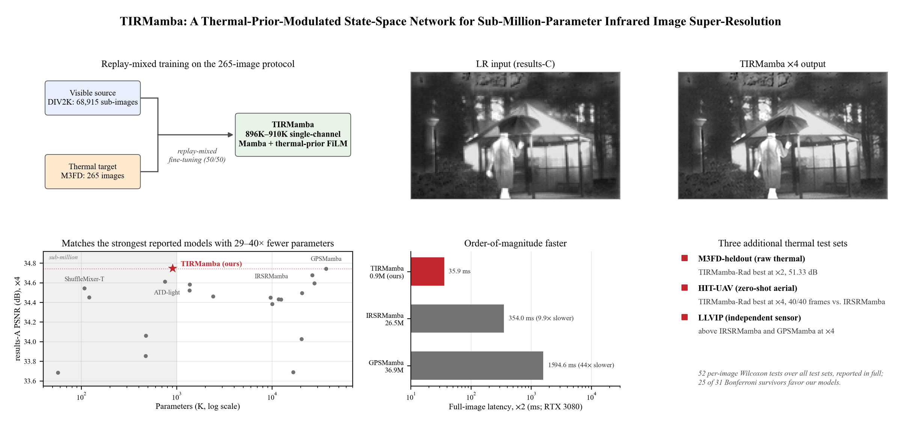
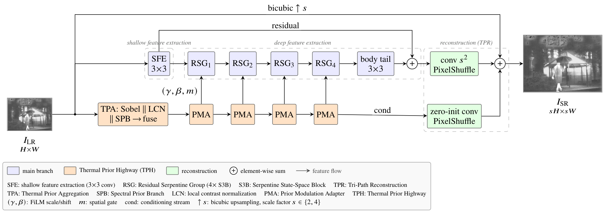
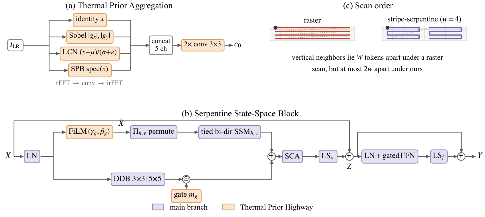
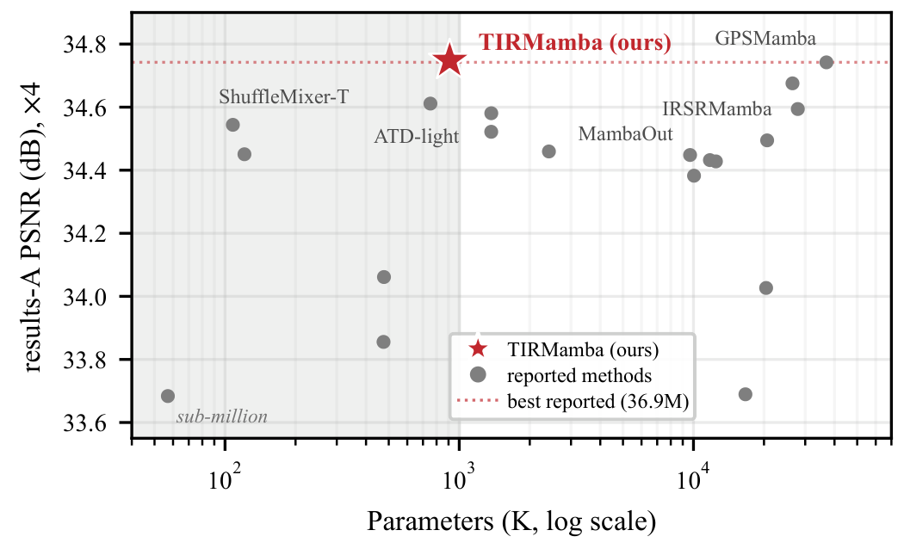
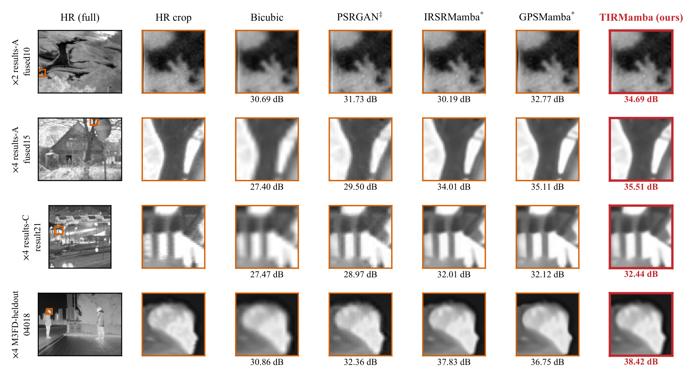

<div align="center">

# TIRMamba

### A Thermal-Prior-Modulated State-Space Network for Sub-Million-Parameter Infrared Image Super-Resolution

**Chun-An Lin**, **Tsung-Jung Liu**<sup>&#9993;</sup>, **Yen-Chieh Ouyang**

Department of Electrical Engineering, National Chung Hsing University, Taichung, Taiwan

[](https://arxiv.org/abs/2610.05182)
[](https://huggingface.co/papers/2610.05182)
[](https://doi.org/10.48550/arXiv.2610.05182)


</div>

<p align="center">
  
</p>

## News

- **2026-10-04**: The preprint is available on [arXiv](https://arxiv.org/abs/2610.05182). The paper has been submitted to *IEEE Transactions on Geoscience and Remote Sensing*.
- The code, trained models and super-resolved results will be released in this repository after the paper is accepted (see [Release plan](#release-plan)).

## Overview

Infrared image super-resolution (SR) is currently led by Mamba-based networks with 26 to 37 million parameters, which are difficult to deploy on the airborne and handheld platforms where thermal imaging is most needed. **TIRMamba** is a state-space SR network with **896K to 910K parameters** for single-channel thermal imagery.

- **Thermal Prior Highway.** Gradient, local-contrast and spectral cues are computed once at the input. One zero-initialized adapter per residual group turns them into a spatially varying FiLM modulation of the scanned input and a gate on a dual-scale detail branch.
- **Lightweight state-space trunk.** Weight-tied bidirectional selective scans with stripe-serpentine ordering, and a tri-path reconstruction that adds the learned residual to a bicubic radiometric baseline.
- **Prior-conditioned selectivity (TIRMamba-Rad).** A raw-thermal operating point that adds the thermal prior to the step size of the selective scan and anchors the reconstruction to the radiometric (DC) level.
- **Protocol-grounded training strategy.** Grayscale DIV2K pre-training followed by replay-mixed fine-tuning on 64-pixel patches drawn equally from the 265 infrared training images and DIV2K.

## Highlights

- At **&times;4**, TIRMamba matches the strongest published methods on both official test sets with **29 to 40 times fewer parameters**.
- Full-image latency is **2.8 to 9.4 times lower at &times;4** and **9.9 to 44 times lower at &times;2** than IRSRMamba and GPSMamba (one RTX 3080 GPU).
- At **&times;2**, TIRMamba gives the highest SSIM on both official test sets.
- On three additional thermal test sets (raw thermal, zero-shot UAV, independent sensor), **TIRMamba-Rad** gives the best &times;4 results.

## Architecture

<p align="center">
  
</p>

<p align="center">
  
</p>

*Top: overall architecture. Bottom: (a) Thermal Prior Aggregation, (b) Serpentine State-Space Block, (c) raster vs. stripe-serpentine scan order.*

## Results

### Official infrared SR benchmark (results-A / results-C)

PSNR (dB) / SSIM on the Y channel, following the protocol of PSRGAN, IRSRMamba and GPSMamba (265 M3FD training images). Competitor scores are the published values; parameter counts are those reported in the source benchmark. The full comparison with 19 methods is in the paper.

| Method | Params (K) | &times;2 results-A | &times;2 results-C | &times;4 results-A | &times;4 results-C |
|:--|--:|:--:|:--:|:--:|:--:|
| Bicubic | &ndash; | 37.6846 / 0.9270 | 38.6222 / 0.9391 | 33.2435 / 0.8313 | 33.8318 / 0.8504 |
| SwinIR | 11,752 | 38.6899 / 0.9374 | 39.5215 / 0.9492 | 34.4321 / 0.8537 | 35.0329 / 0.8710 |
| ATD-light | 753 | 39.0453 / 0.9432 | 40.0375 / 0.9542 | 34.6113 / 0.8569 | 35.2347 / 0.8737 |
| MambaIR | 20,421 | 39.1761 / 0.9437 | 40.1399 / 0.9544 | 34.0267 / 0.8510 | 34.5662 / 0.8681 |
| VisionMamba | 27,880 | 38.7805 / 0.9392 | 39.6339 / 0.9506 | 34.5941 / 0.8564 | 35.2327 / 0.8733 |
| MambaOut | 9,669 | 38.6375 / 0.9371 | 39.4900 / 0.9493 | 34.4483 / 0.8527 | 35.0456 / 0.8698 |
| IRSRMamba | 26,462 | 39.3489 / 0.9440 | 40.2302 / 0.9548 | 34.6755 / 0.8577 | 35.3074 / 0.8745 |
| GPSMamba | 36,942 | **39.3505** / 0.9440 | 40.2418 / 0.9548 | 34.7421 / 0.8587 | 35.4007 / **0.8756** |
| **TIRMamba (ours)** | **896 / 910** | 39.2971 / **0.9443** | **40.2909** / **0.9549** | **34.7478** / **0.8588** | **35.4057** / **0.8756** |

At &times;4 the margins over GPSMamba lie within the benchmark's noise floor, so we read them as parity at a sub-million parameter count rather than a lead (see the paper for the per-image statistical tests).

<p align="center">
  
</p>

### Efficiency (one RTX 3080, full-image inference)

Parameters are those of the released checkpoints; FLOPs and latency for a 135&times;180 input at &times;2 and a 67&times;90 input at &times;4.

| Method | Params (K) &times;2 / &times;4 | &times;2 FLOPs (G) | &times;2 Time (ms) | &times;2 Mem. (MB) | &times;4 FLOPs (G) | &times;4 Time (ms) | &times;4 Mem. (MB) |
|:--|--:|--:|--:|--:|--:|--:|--:|
| IRSRMamba | 20,422 / 20,570 | 401.7 | 354.0 | 955 | 103.4 | 92.1 | 353 |
| GPSMamba | 36,795 / 36,943 | 857.3 | 1594.6 | 3664 | 243.1 | 312.4 | 635 |
| **TIRMamba (ours)** | **896 / 910** | **16.3** | **35.9** | **136** | **4.1** | **33.1** | **45** |
| TIRMamba-Rad (ours) | 948 / 990 | 20.9 | 72.0 | 172 | 5.5 | 49.1 | 55 |

### Generalization to thermal test sets

PSNR (dB) / SSIM on raw thermal imagery (M3FD-heldout), zero-shot UAV imagery (HIT-UAV) and an independent surveillance sensor (LLVIP). IRSRMamba and GPSMamba are evaluated with their officially released checkpoints.

| Method | M3FD-heldout &times;2 | M3FD-heldout &times;4 | HIT-UAV &times;2 | HIT-UAV &times;4 | LLVIP &times;2 | LLVIP &times;4 |
|:--|:--:|:--:|:--:|:--:|:--:|:--:|
| Bicubic | 46.2755 / 0.9919 | 36.7248 / 0.9450 | 44.3950 / 0.9868 | 36.4883 / 0.9381 | 45.3021 / 0.9935 | 36.2073 / 0.9651 |
| IRSRMamba | 50.9925 / 0.9960 | 41.2956 / 0.9718 | 47.0329 / **0.9915** | 39.5859 / 0.9591 | 49.5494 / 0.9957 | 40.9524 / 0.9822 |
| GPSMamba | 50.9514 / 0.9960 | 41.0734 / 0.9711 | **47.0719** / **0.9915** | 39.6305 / 0.9598 | 49.7891 / 0.9958 | 41.0220 / 0.9831 |
| TIRMamba (ours) | 50.8504 / 0.9960 | 41.0540 / 0.9706 | 46.9282 / 0.9910 | 39.5686 / 0.9589 | 49.3758 / **0.9959** | 41.1459 / 0.9834 |
| **TIRMamba-Rad (ours)** | **51.3310** / **0.9962** | **41.3850** / **0.9723** | 46.9564 / **0.9915** | **39.7452** / **0.9606** | **49.8351** / **0.9959** | **41.1687** / **0.9837** |

### Visual comparison

<p align="center">
  
</p>

*&times;2 (top row) and &times;4 (remaining rows); the bottom row is a raw thermal M3FD-heldout frame. Each crop is annotated with its PSNR.*

## Release plan

The following will be released in this repository **after the paper is accepted**:

- [ ] Inference code and evaluation scripts (Y-channel PSNR/SSIM following the benchmark protocol)
- [ ] Pretrained models: TIRMamba (&times;2, &times;4) and TIRMamba-Rad (&times;2, &times;4)
- [ ] Training code and configurations
- [ ] Super-resolved results on results-A, results-C and the additional thermal test sets

Please watch or star this repository to be notified of the release.

## Datasets

All datasets used in the paper are publicly available from their original sources:

- **Benchmark test sets (results-A, results-C):** released with [PSRGAN](https://doi.org/10.6084/m9.figshare.13359632) and [IRSRMamba](https://doi.org/10.6084/m9.figshare.25835938).
- **Training:** the first 265 infrared images of the M3FD fusion subset, following the IRSRMamba/GPSMamba protocol, and grayscale DIV2K for pre-training.
- **Additional test sets:** M3FD-heldout (images 266&ndash;300 of M3FD), HIT-UAV and LLVIP; AID for optical aerial imagery.

## Citation

If you find this work useful, please cite:

```bibtex
@article{lin2026tirmamba,
  title   = {{TIRMamba}: A Thermal-Prior-Modulated State-Space Network for Sub-Million-Parameter Infrared Image Super-Resolution},
  author  = {Lin, Chun-An and Liu, Tsung-Jung and Ouyang, Yen-Chieh},
  journal = {arXiv preprint arXiv:2610.05182},
  year    = {2026},
  doi     = {10.48550/arXiv.2610.05182}
}
```

## Acknowledgements

This work was supported in part by the National Chung-Shan Institute of Science and Technology, Taiwan, and in part by the National Science and Technology Council, Taiwan, under Grant NSTC 114-2221-E-005-040-MY2. We thank the authors of PSRGAN (IEEE SPL, 2021), [IRSRMamba](https://doi.org/10.1109/TGRS.2025.3584385) and [GPSMamba](https://arxiv.org/abs/2507.18998) for releasing the infrared SR benchmark and their models, and the authors of [Mamba](https://github.com/state-spaces/mamba) and [MambaIR](https://github.com/csguoh/MambaIR) for their open-source work.

## Contact

For questions, please open an issue or contact Chun-An Lin (julian135707@gmail.com).
